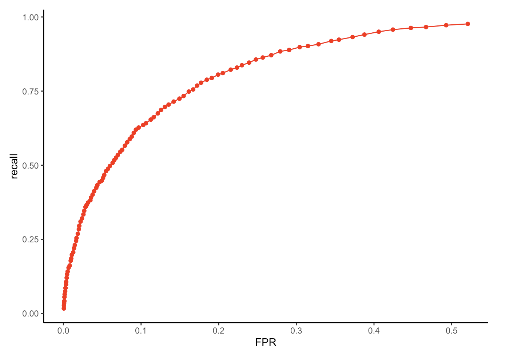
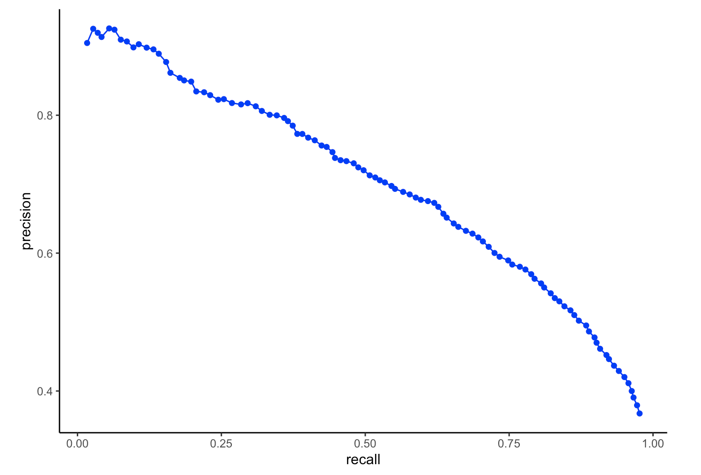

# m6APrediction: Machine Learning-Based Prediction of m6A RNA Modification Sites

## Overview
m6APrediction is an R package designed to identify N6-methyladenosine (m6A) RNA modification sites using a randomForest model trained on sequence-derived features.
It offers a streamlined workflow for m6A site prediction and includes two main functions:

- `prediction_multiple()` — compute the predicted probability for a single sequence feature set 
- `prediction_single()` — generate a probability score for a single RNA feature set


## Installation
Install the package directly from GitHub:
```r
# install.packages("devtools")  # if not installed
devtools::install_github("KeyuFang-xjtlu/m6APrediction")
```

## Example Usage

### Included example files
- `rf_fit.rds`: trained model  
- `m6A_input_example.csv`: example m6A feature dataset  

```r
library(m6APrediction)

# Load the pre-trained model and example feature data
mdl <- readRDS(system.file("extdata", "rf_fit.rds", package = "m6APrediction"))
df  <- read.csv(system.file("extdata", "m6A_input_example.csv", package = "m6APrediction"))

# Multiple-sample prediction
result_multi <- prediction_multiple(mdl, df, positive_threshold = 0.6)
head(result_multi)

# Single-sample prediction
prediction_single(
  ml_fit = mdl,
  gc_content = 0.6,
  RNA_type = "mRNA",
  RNA_region = "CDS",
  exon_length = 12,
  distance_to_junction = 5,
  evolutionary_conservation = 0.8,
  DNA_5mer = "ATCGT",
  positive_threshold = 0.5
)
```

## Model Performance

The ROC and PRC curves generated in Practical 4 are included below to illustrate the model’s predictive performance.

### ROC Curve


### Precision–Recall Curve


